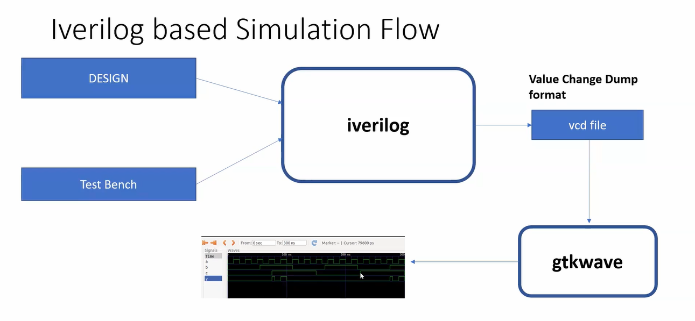
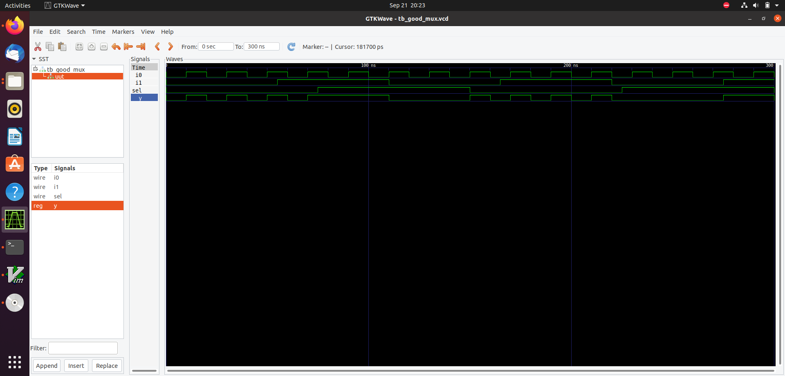

# 🗓️ DAY-1 : Introduction to Verilog RTL design and synthesis

On Day 1 of the lab, I learned how to invoke the tools installed during the previous week of the program. I executed a multiplexer design with its testbench, analyzed the simulation waveforms using GTKWave, and utilized Yosys to synthesize the Verilog code into a netlist.


## 📝Agenda

- [Simulation Flow](#simulation-flow)  
- [Loading the 2×1 MUX Design in Icarus Verilog (Iverilog)](#loading-the-2x1-mux-design-in-icarus-verilog-iverilog)  
- [Installation of GVim](#installing-gvim)  
- [Design Analysis](#design-analysis)  
- [Synthesis Using Yosys](#synthesis-using-yosys)  
- [Synthesis Flow and Verification of the Generated Netlist](#synthesis-flow-and-verification-of-the-generated-netlist)


## Simulation Flow

SIMULATOR:
RTL design is checked for adherence to the specifications by simulating the design.
Simulator is the tool used for simulating the design.

DESIGN:
Design is the actual verilog code or set of verilog codes which has the intended functionality to meet with the required specifications.

TESTBENCH:
Testbench is the setup to apply stimulus to the design to check its functionality.




## Loading the design in iverilog

Instruction 1: Cloning the repository:

```bash
git clone https://github.com/kunalg123/sky130RTLDesignAndSynthesisWorkshop.git
```
Instruction 2: Analyzing the design

To compile and simulate the Verilog design and testbench using iverilog:

```bash
iverilog good_mux.v tb_good_mux.v
```

Execute the compiled output:

```bash 
./a.out 
```

Open the generated .vcd file in GTKWave to visualize the simulation:

```bash 
gtkwave tb_good_mux.vcd
```


## Installation of Gvim

Run the following command to install GVim:
```bash
sudo apt-get update
sudo apt-get install gvim
```
## Design Analysis

This is a 2:1 multiplexer implemented in Verilog.

```verilog
module good_mux (
    input i0, 
    input i1, 
    input sel, 
    output reg y
);

always @(*) begin
    if (sel)
        y <= i1;
    else 
        y <= i0;
end

endmodule
```
 Description:

- **i0, i1**: Inputs to the multiplexer  
- **sel**: Select signal  
- **y**: Output, which follows `i1` when `sel = 1` and `i0` when `sel = 0`

## Synthesis using YOSYS

Yosys is an open-source framework for Verilog RTL synthesis. It converts your high-level Verilog code into a gate-level netlist, which can later be used for simulation, FPGA implementation, or ASIC design.

Key Points:

- Open-source RTL synthesis tool  
- Supports Verilog designs  
- Generates optimized gate-level netlists  
- Technology mapping for FPGA or ASIC  
- Flexible scripting and automation  
- Integrates with verification and optimization tools  


 Why Different Flavours of Gates?

The **combinational delay** in a logic path determines the maximum speed of a digital circuit. To achieve high performance, we need **fast cells** that minimize the combinational delay (`t_comb`).  

However, using only fast cells can cause **hold time violations** at flip-flops. To ensure reliable operation, we also need **slow cells** that help meet hold time requirements.  

A library containing both fast and slow cells allows designers to **balance speed and timing constraints**, forming a standard `.lib` file used in synthesis and timing analysis.

Selection of Cells:

During synthesis, we need to guide the synthesizer to select the **optimum flavour of cells** for implementing a logic circuit.  

- **Using more fast cells:**  
  - Can create a circuit that is **bad in terms of power and area**  
  - May cause **hold time violations**  

- **Using more slow cells:**  
  - Leads to a **sluggish circuit**  
  - May **fail to meet performance requirements**  

- **Solution:**  
  - Provide **constraints** to the synthesizer, guiding it to balance fast and slow cells to meet both **timing** and **performance** goals.


## Synthesis flow and verification of the generated netlist

Yosys Synthesis Flow:

Follow these steps to synthesize a Verilog design using **Yosys**:

1.Invoke Yosys  
```bash
yosys
```

2.Read the Standard-Cell Library
```bash
read_liberty -lib /address/to/your/sky130/file/sky130_fd_sc_hd__tt_025C_1v80.lib
```

3.Read the Verilog Design
     
 ```bash
read_verilog /home/lavanya/VLSI/sky130RTLDesignAndSynthesisWorkshop/verilog_files/good_mux.v
```

4.Synthesize the Design
```bash
synth -top good_mux
```

5.Map to Technology Library using ABC
 ```bash
abc -liberty /address/to/your/sky130/file/sky130_fd_sc_hd__tt_025C_1v80.lib
```
6.show 
```bash
show
```


7.Write the Synthesized Netlist
```bash
write_verilog -noattr good_mux_net.v
```
