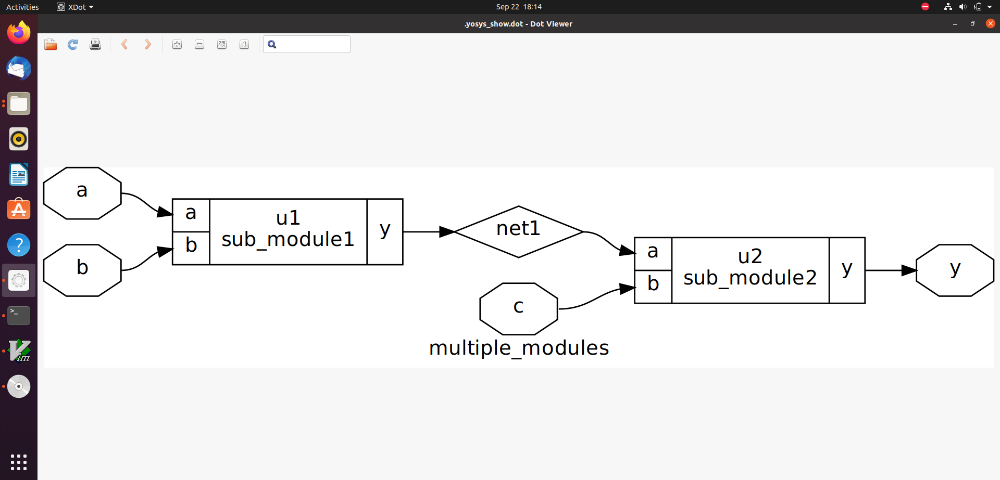
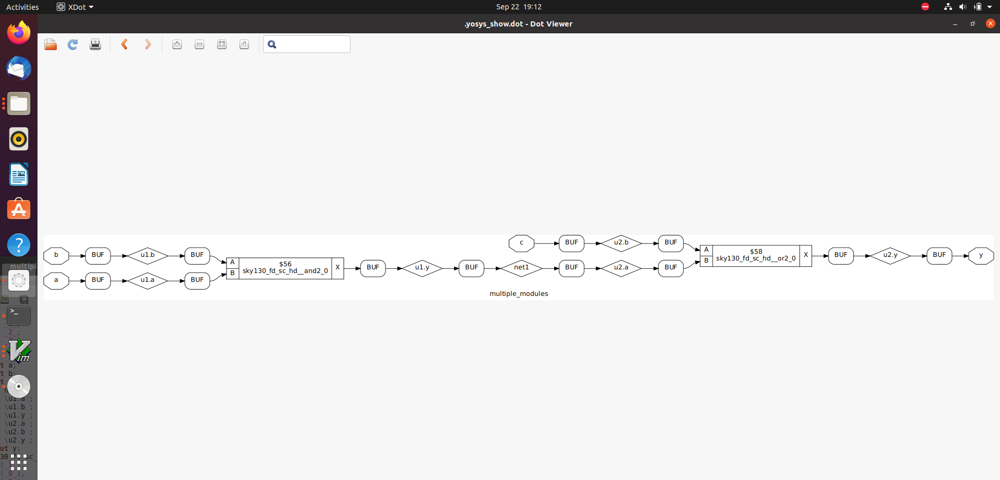
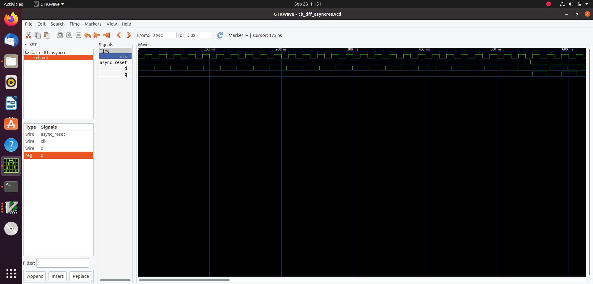
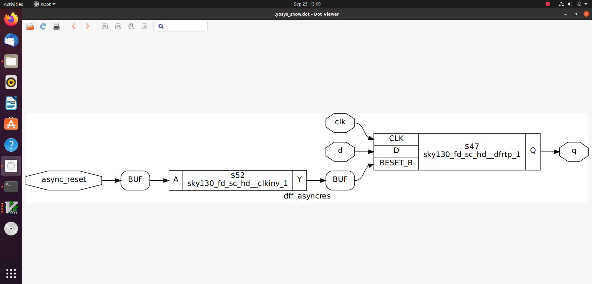
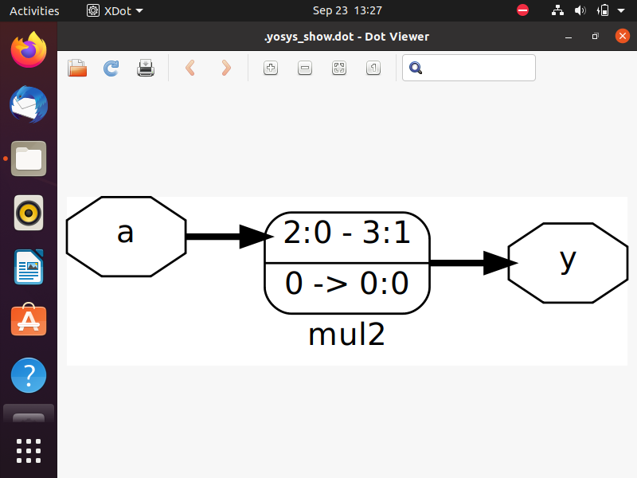

# 🗓️ DAY-2 :Standard Cell Library, Logic Synthesis and Flip-Flop Design

This covers three crucial topics:  

- Understanding the **.lib timing library** (`sky130_fd_sc_hd__tt_025C_1v80.lib`) used in open-source PDKs.  
- Comparing **hierarchical vs. flat synthesis** methods.  
- Exploring **efficient coding styles for flip-flops** in RTL design.  


## 📝 Agenda

### [Standard Cell Libraries](#standard-cell-libraries)
- [Overview of the SKY130 Open-Source PDK](#overview-of-the-sky130-open-source-pdk)  
- [Understanding tt_025C_1v80 in SKY130 PDK](#understanding-tt_025c_1v80-in-sky130-pdk)  
- [Exploring the Standard-Cell Library File](#exploring-the-standard-cell-library-file)  

### [Hierarchical vs. Flattened Synthesis](#hierarchical-vs-flattened-synthesis)
- [Hierarchical Synthesis](#hierarchical-synthesis)  
- [Flattened Synthesis](#flattened-synthesis)  

### [D Flip-Flop Design](#d-flip-flop-design)
- [Asynchronous Reset D Flip-Flop](#asynchronous-reset-d-flip-flop)  
- [Asynchronous Set D Flip-Flop](#asynchronous-set-d-flip-flop)  
- [Synchronous Reset D Flip-Flop](#synchronous-reset-d-flip-flop)  
- [Synchronous Set D Flip-Flop](#synchronous-set-d-flip-flop)  

### [Simulation and Synthesis](#simulation-and-synthesis)
- [Compile and Simulate the Verilog Design](#compile-and-simulate-the-verilog-design)  
- [Synthesis](#synthesis)  

### [Synthesis Optimization](#synthesis-optimization)
- [Multiplying a Binary Number by Powers of 2](#multiplying-a-binary-number-by-powers-of-2)  
- [Multiplying a Binary Number by 9](#multiplying-a-binary-number-by-9)


## Standard Cell Libraries

**Overview of the SKY130 Open-Source PDK**

The SKY130 PDK is an open-source Process Design Kit developed around SkyWater Technology’s 130 nm CMOS node. It offers the fundamental models and libraries required for integrated circuit (IC) design, covering aspects such as timing, power, and process variation.

**Understanding tt_025C_1v80 in SKY130 PDK**

tt - typical

025c - 25 °C (25 degrees Celsius)

1v80 - 1.8 volts

**Exploring the Standard-Cell Library File**

Installing text editor:

Gedit is a simple graphical text editor for Linux:

```bash
sudo apt update
sudo apt install gedit 
```

Navigate to the file:

To view or edit the sky130_fd_sc_hd__tt_025C_1v80.lib:

```bash
gedit sky130_fd_sc_hd__tt_025C_1v80.lib
```

## Hierarchical vs. Flattened Synthesis  

### 1. Hierarchical Synthesis
- Maintains the **module hierarchy** from the RTL design.  
- Synthesis is performed **module by module**.

**Advantages:**  
- Easier to debug and verify individual modules.  
- Reduces memory usage during synthesis for large designs.  
- Preserves hierarchy for later design stages.

**Disadvantages:**  
- May produce less optimized logic compared to flattened synthesis.




### 2. Flattened Synthesis
- Ignores module hierarchy; treats the design as a **single block**.  
- All logic is optimized **globally** across the entire design.

**Advantages:**  
- Potential for better **timing** and **area optimization**.  
- Global optimizations can reduce redundant logic.

**Disadvantages:**  
- Harder to debug large designs.  
- Can require more memory and processing power during synthesis.



## Comparison: Hierarchical vs. Flattened Synthesis

| Feature                        | Hierarchical Synthesis                        | Flattened Synthesis                          |
|--------------------------------|-----------------------------------------------|---------------------------------------------|
| **Module Hierarchy**            | Preserves module hierarchy                    | Ignores hierarchy; treats design as a single block |
| **Synthesis Scope**             | Module by module                              | Global optimization across entire design   |
| **Advantages**                  | Easier to debug, reduces memory usage, preserves hierarchy | Better timing and area optimization, reduces redundant logic |
| **Disadvantages**               | May be less optimized                          | Harder to debug, higher memory and processing requirements |
| **Use Case**                    | Large, modular designs where debugging is important | Designs requiring maximum performance and area optimization |


## D Flip-Flop Design 

Flip-flops are essential sequential building blocks in digital circuits, used to store binary information. The following sections highlight efficient RTL coding styles for handling various reset and set behaviors.

Asynchronous reset D Flip flop:

```verilog
module dff_asyncres (input clk,input async_reset,input d,output reg q );
  always @ (posedge clk, posedge async_reset)
    if (async_reset)
      q <= 1'b0;
    else
      q <= d;
endmodule
```
Description

clk: Clock input

async_reset: Asynchronous reset input; sets q to 0 immediately

d: Data input

q: Output that follows d on the rising edge of clk when reset is not active

Asynchronous set D Flip flop:

```verilog
module dff_async_set (input clk,input async_set,input d,output reg q );
  always @ (posedge clk, posedge async_set)
    if (async_set)
      q <= 1'b1;
    else
      q <= d;
endmodule
```
Description

clk: Clock input

async_set: Asynchronous set input; sets q to 1 immediately

d: Data input

q: Output that follows d on the rising edge of clk when set is not active

synchronous reset D Flip flop:

```verilog
module dff_syncres (input clk,input sync_reset,input d,output reg q );
  always @ (posedge clk)
    if (sync_reset)
      q <= 1'b0;
    else
      q <= d;
endmodule
```
Description

clk: Clock input

sync_reset: Synchronous reset input; sets q to 0 on the next rising edge of clk

d: Data input

q: Output that follows d on the rising edge of clk when reset is not active

synchronous set D Flip flop:
```verilog
module dff_syncres (input clk,input sync_set,input d,output reg q );
  always @ (posedge clk)
    if (sync_set)
      q <= 1'b1;
    else
      q <= d;
endmodule
```
Description

clk: Clock input

sync_set: Synchronous set input; sets q to 1 on the next rising edge of clk

d: Data input

q: Output that follows d on the rising edge of clk when set is not active
## Simulation and Synthesis
To compile and simulate the Verilog design and testbench using iverilog:

```bash
iverilog dff_asyncres.v tb_dff_asyncres.v
```

Execute the compiled output:

```bash 
./a.out 
```

Open the generated .vcd file in GTKWave to visualize the simulation:

```bash 
gtkwave tb_dff_asyncres.vcd
```



**Synthesis**

Follow these steps to synthesize a Verilog design using **Yosys**:

1.Invoke Yosys  
```bash
yosys
```

2.Read the Standard-Cell Library
```bash
read_liberty -lib /address/to/your/sky130/file/sky130_fd_sc_hd__tt_025C_1v80.lib
```

3.Read the Verilog Design
     
 ```bash
read_verilog /home/lavanya/VLSI/sky130RTLDesignAndSynthesisWorkshop/verilog_files/dff_asyncres.v.v
```

4.Synthesize the Design
```bash
synth -top dff_asyncres.v
```
5.mapping dff library
```bash
dfflibmap -liberty ../path/to/sky130_fd_sc_hd__tt_025C_1v80
```
6.Map to Technology Library using ABC
 ```bash
abc -liberty /address/to/your/sky130/file/sky130_fd_sc_hd__tt_025C_1v80.lib
```
7.show 
```bash
show
```

## Synthesis optimization

### 1. Multiplying a Binary Number by Powers of 2
- **Concept:** Multiplying a binary number by `2^n` can be implemented by **shifting left by n positions**.  
- **Example:**  
  - `a * 2` → append **one `0` at LSB**  
  - `a * 4` → append **two `0`s at LSB**  
- **Benefit:** Avoids using a full multiplier, saving **area and improving performance**.

### 2. Multiplying a Binary Number by 9
- **Concept:** Break the multiplication into simpler operations:  
  ```text
  a * 9 = a * (8 + 1) = (a * 8) + a
  ```

