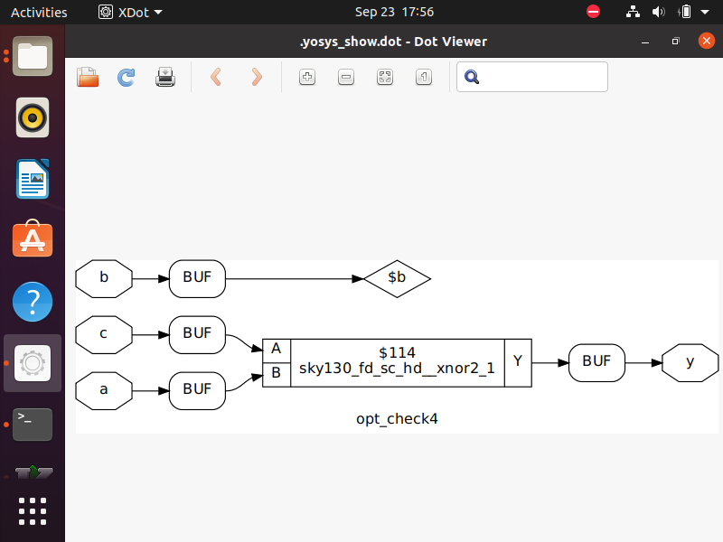

# 🗓️ DAY-3 : Combinational and Sequential Logic Optimization

On Day 3 of the workshop, we explore strategies to enhance the efficiency and performance of digital circuits by optimizing both combinational and sequential logic.  


## 📝 Agenda

### [Combinational Logic Optimization](#combinational-logic-optimization)
- [Squeezing the logic to get the most optimized design](#squeezing-the-logic-to-get-the-most-optimized-design)  
- [Constant Propagation](#constant-propagation)  
- [Boolean Logic Optimization](#boolean-logic-optimization)  

### [Sequential Logic Optimization](#sequential-logic-optimization)
- [Sequential Constant Propagation](#sequential-constant-propagation)  
- [State Optimization](#state-optimization)  
- [Retiming](#retiming)  
- [Sequential Logic Cloning](#sequential-logic-cloning)  

### [Unused Output Optimization](#unused-output-optimization)

## [ Labs on Optimization](#labs-on-optimization)

- [Lab 1](#lab-1)  
- [Lab 2](#lab-2)  
- [Lab 3](#lab-3)  
- [Lab 4](#lab-4)  
- [Lab 5](#lab-5)  
- [Lab 6](#lab-6)
- [Lab 7](#lab-7)


## Combinational Logic Optimization

###Squeezing the Logic to Get the Most Optimized Design

**Definition:**  
Optimize a digital design by removing redundant gates, merging logic, and simplifying paths.

**Key Techniques:**  
- Constant propagation  
- Boolean simplification  
- Removing unused signals

**Benefits:**  
- Reduced area and power  
- Improved speed  
- Cleaner, easier-to-verify netlist

**Example:**  
```text
Original: y = (a AND b) OR (a AND b AND c)
Optimized: y = a AND b
```
### Constant Propagation

**Definition:**  
Constant propagation is a combinational logic optimization technique where constant values in a design are identified and propagated through the logic network.

**How it Works:**  
- If a signal is tied to a constant (`0` or `1`), the synthesizer replaces all instances of that signal with the constant value.  
- Logic expressions involving constants are automatically simplified.

**Example:**  
```text
y = a AND 1  →  y = a
y = a AND 0  →  y = 0
```
### Boolean Logic Optimization

**Definition:**  
Boolean logic optimization is the process of simplifying Boolean expressions to reduce the number of gates, logic levels, and overall complexity.

**How it Works:**  
- Apply algebraic simplifications such as De Morgan’s laws, distributive, associative, and commutative properties.  
- Synthesis tools automatically minimize logic to remove redundancy.

**Example:**  
```text
Original: y = (a AND b) OR (a AND b AND c)
Simplified: y = a AND b
```
## Sequential Logic Optimization

### Sequential Constant Propagation

**Definition:**  
Sequential constant propagation is an optimization technique applied to sequential circuits (flip-flops, latches, and registers) where constant values are propagated through sequential elements to simplify logic and states.

**How it Works:**  
- Identify signals or states that always assume constant values under certain conditions.  
- Propagate these constants through flip-flops and combinational logic.  
- Simplify logic or remove unnecessary transitions that do not affect circuit behavior.

**Example:**  
```text
A flip-flop Q is always reset under certain input conditions.
Logic dependent on Q can be simplified using Q = 0, reducing gates and paths.
```

### State Optimization

**Definition:**  
State optimization is a technique used in sequential circuits (like finite state machines, FSMs) to reduce the number of states without changing the circuit’s functional behavior.

**How it Works:**  
- Identify equivalent or redundant states in the state machine.  
- Merge these states into a single representative state.  
- Update the state transition table and logic to reflect the merged states.

**Example:**  
```text
An FSM has states S1 and S2 that behave identically for all inputs.
Merge S1 and S2 into a single state, reducing the total number of states and required flip-flops.
```
### Retiming

**Definition:**  
Retiming is a sequential circuit optimization technique where flip-flops are repositioned across combinational logic to improve performance while preserving the circuit’s functional behavior.

**How it Works:**  
- Move flip-flops forward or backward across logic gates without changing input-output behavior.  
- Adjust timing paths to balance delays, reduce critical path length, and meet timing constraints.  
- Often used with synthesis tools that automatically determine optimal register placement.

**Example:**  
```text
A critical path with high combinational delay can be split by moving a flip-flop to shorten the path, improving the maximum operating frequency.
```
### Sequential Logic Cloning

**Definition:**  
Sequential logic cloning is an optimization technique where copies of certain sequential elements (like flip-flops or registers) are created to balance load, reduce fan-out, or shorten critical paths in a circuit.

**How it Works:**  
- Identify flip-flops or registers driving multiple downstream logic blocks (high fan-out).  
- Create clones of the sequential element to drive subsets of the logic independently.  
- This reduces the load on any single flip-flop, improving timing and reliability.

**Example:**  
```text
A flip-flop Q drives 10 logic blocks, causing a long delay.
By cloning Q, two flip-flops each drive 5 blocks, reducing delay and improving performance.
```
## Unused Output Optimization

**Definition:**  
Unused output optimization removes or simplifies logic associated with outputs that are never used, reducing unnecessary gates and logic levels.

**How it Works:**  
- Identify outputs that are never read or connected externally.  
- Remove or mark the logic driving these outputs as "don't care" to allow synthesis optimization.  
- Simplify intermediate logic that only affects unused outputs.

**Example:**  
```text
A module generates outputs y1, y2, y3, but only y1 is used.
Logic for y2 and y3 can be removed by the synthesizer.
```
## Labs on optimization

### Lab 1
verilog code:
```verilog
module opt_check (input a , input b , output y);
    assign y = a ? b : 0;
endmodule
```
Description:

Implements a conditional assignment using a ternary operator.

Output y follows b when control signal a is 1.

Output y is 0 when control signal a is 0.

Follow the steps from [Day 1 Synthesis flow](#day-1-synthesis-flow) and insert the following step **between `abc -liberty` and `synth -top`** commands.

```bash
opt_clean -purge
```


### Lab 2

verilog code:
```verilog
module opt_check2 (input a , input b , output y);
	assign y = a?1:b;
endmodule
```
Description:
Combinational logic module using a ternary operator.

Inputs: a, b

Output: y

Logic behavior:

If a = 1, y = 1

If a = 0, y = b


### Lab 3

verilog code:
```verilog
module opt_check3 (input a , input b , output y);
	assign y = a?1:b;
endmodule
```
Description:
Combinational logic module using a ternary operator.

Inputs: a, b

Output: y

Logic behavior:

If a = 1, y = 1

If a = 0, y = b


### Lab 4

verilog code:
```verilog
module opt_check4 (input a , input b , input c , output y);
 assign y = a?(b?(a & c ):c):(!c);
 endmodule
```
Description:
Combinational logic module using nested ternary operators.

Inputs: a, b, c

Output: y depends on the combination of a, b, and c.

Logic behavior:

If a = 1 and b = 1, y = a & c

If a = 1 and b = 0, y = c

If a = 0, y = !c


### Lab 5

verilog code:
```verilog
module dff_const1(input clk, input reset, output reg q);
always @(posedge clk, posedge reset)
begin
	if(reset)
		q <= 1'b0;
	else
		q <= 1'b1;
end
endmodule
```
Description:
D flip-flop with asynchronous reset.

Output q is reset to 0 when reset = 1.

Output q becomes 1 on the next clock edge if reset = 0.

### Lab 6

verilog code:
```verilog
module dff_const2(input clk, input reset, output reg q);
always @(posedge clk, posedge reset)
begin
	if(reset)
		q <= 1'b1;
	else
		q <= 1'b1;
end
endmodule
```
Description:
D flip-flop with asynchronous reset.

Output q is always set to 1, independent of clock or reset.

Demonstrates a constant-output flip-flop.


### Lab 7
```verilog
module counter_opt (input clk, input reset, output q);
reg [2:0] count;
assign q = count[0];
always @(posedge clk ,posedge reset)
begin
    if (reset)
        count<=3'b000;
    else
        count <= count + 1;
end
endmodule
```
Description:

3-bit up-counter with asynchronous reset.

Inputs: clk (clock), reset (asynchronous reset)

Output: q (least significant bit of the counter)

Behavior:

On reset = 1, counter is set to 0 (3'b000)

On each rising clock edge, counter increments by 1

q = count[0] toggles every clock cycle (acts as a divide-by-2 output)


### case 2:

when q<=(count[2:0]==3'b100);


