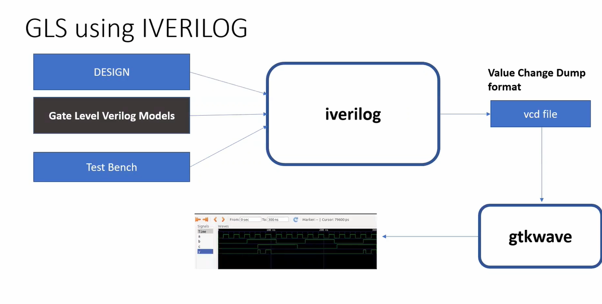
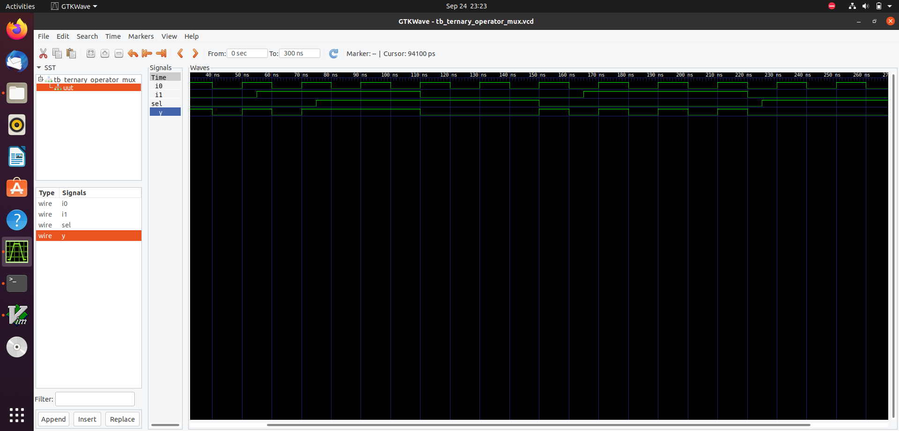
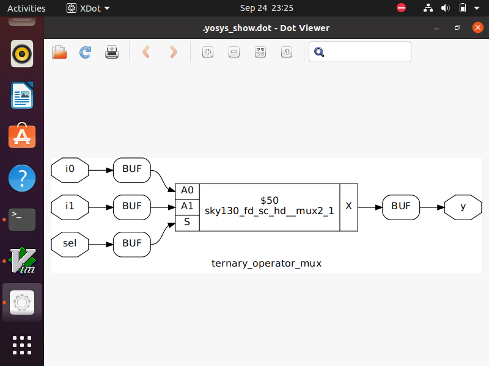
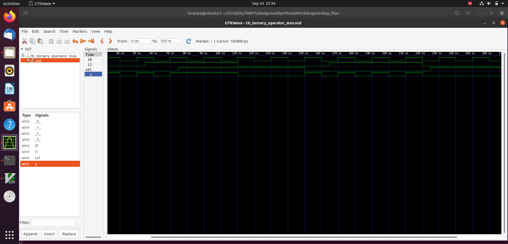
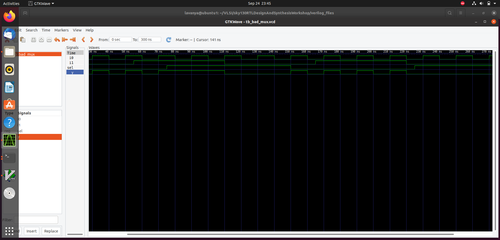
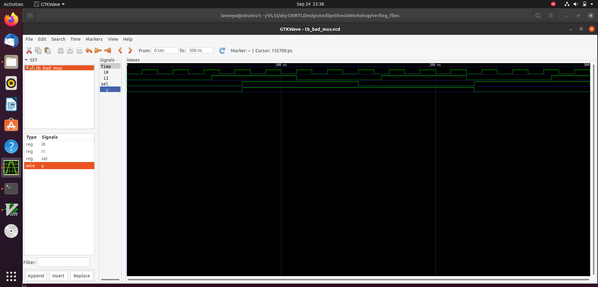
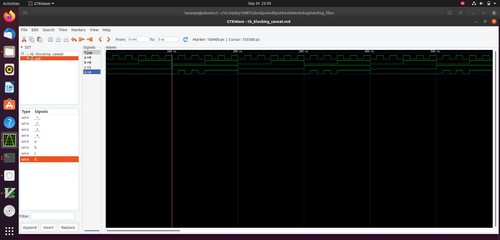
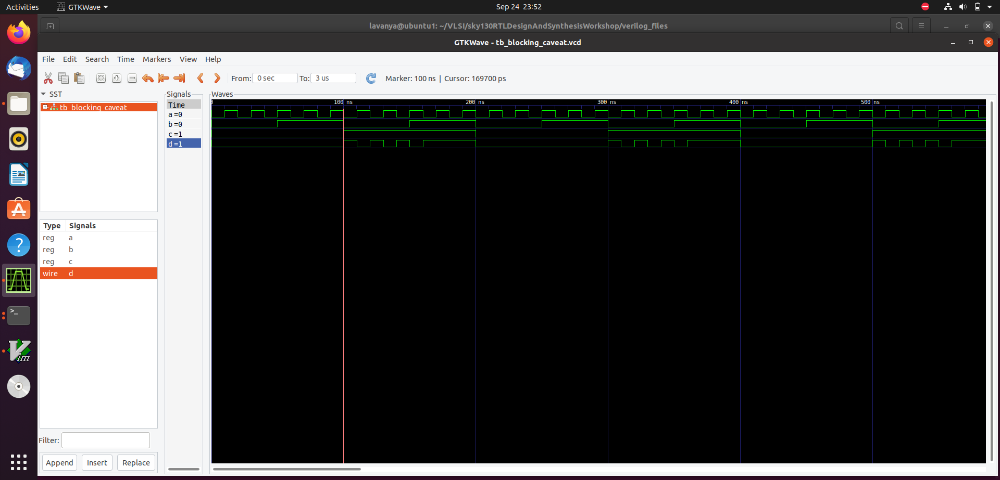

# 🗓️ DAY-4 : Gate-Level Simulation (GLS), Blocking vs. Non-Blocking in Verilog, and Synthesis-Simulation Mismatch

Day 4: Focuses on gate-level simulation (GLS), understanding the difference between blocking and non-blocking assignments in Verilog, and identifying synthesis-simulation mismatches in digital designs.


## 📝 Agenda

- [What is GLS?](#what-is-gls)  
- [Why GLS?](#why-gls)  
- [Blocking and Non-Blocking Statements in Verilog](#blocking-and-non-blocking-statements-in-verilog)  
- [Synthesis and Simulation Mismatch](#synthesis-and-simulation-mismatch)  
- [GLS Labs](#gls-labs)


## What is GLS?

### 🔎 Gate-Level Simulation (GLS)

**Definition:**  
Gate-Level Simulation (GLS) is a type of digital circuit simulation that models a design at the **gate level**, using **logic gates, flip-flops, and interconnects** rather than high-level RTL constructs.  

### ✅ Key Points:
- Uses **post-synthesis or post-layout netlists**.  
- Simulates the **actual timing delays** of gates and wires.  
- Helps verify **functional correctness** after synthesis or place-and-route.  

### 🎯 Purpose:
- Detects **timing issues, glitches, and race conditions**.  
- Ensures the synthesized design behaves as intended **before fabrication**.  



## Why GLS?

Gate-Level Simulation (GLS) is essential because:

- **✅ Post-Synthesis Verification**: Confirms that the synthesized netlist matches the RTL design.  
- **🔍 Detects Mismatches**: Finds simulation-synthesis mismatches introduced by synthesis optimizations.  
- **⏱️ Timing Verification**: Checks setup, hold, and propagation delays to ensure timing correctness.  
- **⚡ Glitch & Race Detection**: Identifies hazards and race conditions not visible in RTL simulation.  
- **🏁 Final Confidence**: Provides assurance that the design is correct before tape-out/fabrication.  

## Blocking and Non-Blocking Statements in Verilog

### 1️⃣ Blocking Statements (`=`)
- **Definition**: Execute sequentially, one after another.
- **Behavior**: Next statement runs only after the current one completes.
- **Usage**: Best for **combinational logic**.

**Example:**
```verilog
always @(*) begin
  x = a & b;   // executed first
  y = x | c;   // executed after x is updated
end
```
### 2️⃣ Non-Blocking Statements (<=)
- **Definition**: Schedule assignments to update at the end of the time step.
- **Behavior**: Statements execute in parallel.
- **Usage**: Best for sequential (clocked) logic.
**Example:**
```verilog
always @(posedge clk) begin
  q1 <= d;     // scheduled for update
  q2 <= q1;    // both updates happen in parallel
end
```
## 🔑 Key Differences: Blocking vs Non-Blocking in Verilog

- **Blocking (`=`)** → Sequential execution.  
- **Non-Blocking (`<=`)** → Parallel execution.  

### ✅ Best Practice
- Use `=` in **combinational logic**.  
- Use `<=` in **sequential logic**.  

### Blocking vs Non-Blocking Statements

| Feature                   | Blocking (`=`)                        | Non-Blocking (`<=`)                   |
|----------------------------|--------------------------------------|--------------------------------------|
| Execution                  | Sequential                           | Parallel / Scheduled at end of time step |
| Usage                      | Combinational logic                  | Sequential (clocked) logic           |
| Behavior                   | Next statement waits for current to complete | Statements execute concurrently       |
| Common Issue if Misused    | Simulation may not match synthesized design | Rarely causes mismatch if used correctly |
| Best Practice              | Use in combinational `always @(*)` blocks | Use in sequential `always @(posedge clk)` blocks |

## Synthesis and Simulation Mismatch

**Definition:**  
Occurs when RTL simulation and synthesized netlist behave differently.  

**Causes:**  
- Misuse of blocking (`=`) vs. non-blocking (`<=`) assignments  
- Uninitialized signals or registers  
- Delay statements (`#`) ignored during synthesis  
- Incomplete sensitivity lists or unintended latches  

**Why it Matters:**  
- Can lead to chip failures even if RTL simulation passes  

**Best Practices:**  
- Use `<=` in sequential logic  
- Avoid using `#` delays in synthesizable code  
- Use `always @(*)` for combinational logic  
- Ensure proper reset and initialization  

## GLS Labs

### Lab 1:
Verilog implementation of a 2:1 multiplexer using a conditional (ternary) operator:
```verilog
module ternary_operator_mux (input i0, input i1, input sel, output y);
  assign y = sel ? i1 : i0;
endmodule
```
Behavior:

If sel = 1, output y = i1

If sel = 0, output y = i0

### Lab 2:
Perform synthesis of the above MUX using Yosys by following the standard Yosys synthesis procedure:

### Lab 3:
Perform Gate-Level Simulation (GLS) on the synthesized MUX using the following command, adjusting file paths as necessary:

**Command:**  
```bash
iverilog /path/to/primitives.v /path/to/sky130_fd_sc_hd.v ternary_operator_mux.v testbench.v -o mux_sim.out
```

### Lab 4:
Verilog code designed with deliberate mistakes:
```verilog
module bad_mux (input i0, input i1, input sel, output reg y);
  always @ (sel) begin
    if (sel)
      y <= i1;
    else 
      y <= i0;
  end
endmodule
```
Description:

2:1 multiplexer with intentional design issues.

Inputs: i0, i1, sel

Output: y (registered output)

Issue: Sensitivity list includes only sel, not i0 or i1, leading to incorrect behavior in simulation.

Uses non-blocking assignments (<=) inside a combinational block, which is not recommended.

Useful for demonstrating synthesis vs. simulation mismatches.

Fixed version of the module with proper sensitivity list and correct coding style:
```verilog
always @ (*) begin
  if (sel)
    y = i1;
  else
    y = i0;
end
```

### Lab 5:

Run Gate-Level Simulation (GLS) on the bad_mux module. Simulation may show mismatches or warnings because of the intentional coding issues:


### Lab 6:

Verilog code:
```verilog
module blocking_caveat (input a, input b, input c, output reg d);
  reg x;
  always @ (*) begin
    d = x & c;
    x = a | b;
  end
endmodule
```
Description:
Combinational logic module with blocking assignments (=).

Inputs: a, b, c

Output: d

Internal Signal: x (register used in combinational logic)

Behavior:

d = x & c

x = a | b

issues:

1.Blocking assignment dependency:

d depends on x, but x is updated after d in the same always block.

Causes simulation mismatch compared to intended combinational behavior.

2.Incorrect combinational coding:

Using a reg (x) inside a combinational block with sequential-like behavior can create latches if not careful.

3.Best Practice Violation:

For combinational logic, all outputs should be computed from inputs directly, and blocking assignments should avoid interdependencies that may cause glitches.

Fixed version of the module with proper sensitivity list and correct coding style:

```verilog
always @ (*) begin
  x = a | b;
  d = x & c;
end
```


### Lab 7:
Perform synthesis on the fixed version of the module and examine the output behavior and results:



