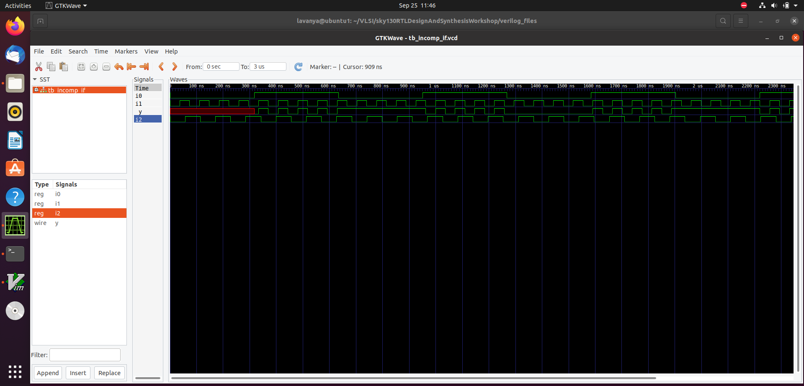

# 🗓️ DAY-5 : Optimization in Synthesis

In this session, we’ll explore Verilog synthesis optimizations, including if-else statements, for loops, and generate blocks, and discuss how incorrect coding can result in inferred latches. Practical labs will provide hands-on experience.


## 📝 Agenda

- [If-Case Constructs in Verilog](#If-Case-Constructs-in-Verilog)
- [Incomplete If-Case Statements](#incomplete-if-case-statements)
- [Labs on Incomplete Case in Verilog:](Labs-on-Incomplete-Case-in-Verilog:)
  - [Incomplete if statement](#incomplete-if-statement)
  - [Nested if-else statement](#nested-if-else-statement)
  - [Complete case statement](#complete-case-statement)
  - [Incomplete case statement](#incomplete-case-statement)
  - [Partial assignment in case](#partial-assignment-in-case)

- [For Loop and For-Generate in Verilog](For-Loop-and-For-Generate-in-Verilog)
- [Labs on For Loop and For-Generate:](Labs-on-For-Loop-and-For-Generate:)
  - [4x1 MUX using for loop](#4x1-mux-using-for-loop)
  - [8x1 DEMUX using case](#8x1-demux-using-case)
  - [8x1 DEMUX using for loop](#8x1-demux-using-for-loop)

- [Ripple Carry Adder (RCA)](Ripple-Carry-Adder-(RCA))
- [8-bit Ripple Carry Adder with generate block](#8-bit-ripple-carry-adder-with-generate-block)

## If-Case Constructs in Verilog

If-else statements allow conditional execution in behavioral modeling and are commonly used inside procedural blocks such as always, initial, tasks, or functions.

**Syntax:**  
```verilog
if (condition) begin
    // executed if condition is true
end else begin
    // executed if condition is false
end
```
The condition must evaluate to a Boolean (0 or 1).

The else block is optional.

## Nested If-Else Example in Verilog

```verilog
if (cond1) begin
    // executed if cond1 is true
end else if (cond2) begin
    // executed if cond1 is false and cond2 is true
end else begin
    // executed if all above conditions are false
end
```
The first block executes if cond1 is true.

If cond1 is false but cond2 is true, the second block executes.

If neither cond1 nor cond2 are true, the else block executes.


## Incomplete If-Case Statements in verilog

**Definition:**  
An incomplete if-else occurs when not all input conditions are handled, which can cause unintended latches.

**Example (Problematic):**
```verilog
always @(a or b) begin
    if (a)
        y = 1;
    else if (b)
        y = 0;
    // else missing → y may retain previous value
end
```
Key Points:

Happens often in combinational always blocks.

Every possible input combination should produce a defined output to avoid inferred latches.

The else block is critical to make the statement complete.

Always ensure every possible condition assigns a value to avoid inferred latches.

Corrected Version:
```verilog
always @(a or b) begin
    if (a)
        y = 1;
    else if (b)
        y = 0;
    else
        y = 0; // output always assigned
end
```

## Labs on Incomplete Case in Verilog:
### Incomplete if statement:
verilog code:
```verilog
module incomp_if (input i0, input i1, input i2, output reg y);
always @(*) begin
    if (i0)
        y <= i1;
end
endmodule
```
Description:
Inputs: i0, i1, i2

Output: y (registered output)

Behavior:

If i0 = 1, y is assigned the value of i1.

If i0 = 0, y is not assigned, which can lead to inferred latch.



Synthesis:


### Nested if else statement
```verilog
module incomp_if2 (input i0, input i1, input i2, input i3, output reg y);
always @(*) begin
    if (i0)
        y <= i1;
    else if (i2)
        y <= i3;
end
endmodule
```
Description:
Inputs: i0, i1, i2, i3

Output: y (registered output)

Behavior:

If i0 = 1, y is assigned the value of i1.

Else if i2 = 1, y is assigned the value of i3.

If neither i0 nor i2 is 1, y is not assigned, potentially causing an inferred latch.


Synthesis:


### Complete case statement
```verilog
module comp_case (input i0, input i1, input i2, input [1:0] sel, output reg y);
always @(*) begin
    case(sel)
        2'b00 : y = i0;
        2'b01 : y = i1;
        default : y = i2;
    endcase
end
endmodule
```
Description:
Inputs: i0, i1, i2, sel[1:0]

Output: y (registered output)

Behavior:

If sel = 2'b00, y = i0

If sel = 2'b01, y = i1

For all other sel values, y = i2 (handled by default)


Synthesis:


### Incomplete case statement
```verilog
module bad_case (
    input i0, input i1, input i2, input i3,
    input [1:0] sel,
    output reg y
);
always @(*) begin
    case(sel)
        2'b00: y = i0;
        2'b01: y = i1;
        2'b10: y = i2;
        2'b1?: y = i3; // '?' is a wildcard; be careful with incomplete cases!
    endcase
end
endmodule
```
Description:
Inputs: i0, i1, i2, i3, sel[1:0]

Output: y (registered output)

Behavior:

If sel = 2'b00 → y = i0

If sel = 2'b01 → y = i1

If sel = 2'b10 → y = i2

If sel matches 2'b1? → y = i3 (wildcard ? used)


### Partial assignment in case
```verilog
module partial_case_assign (
    input i0, input i1, input i2,
    input [1:0] sel,
    output reg y, output reg x
);
always @(*) begin
    case(sel)
        2'b00: begin
            y = i0;
            x = i2;
        end
        2'b01: y = i1;
        default: begin
            x = i1;
            y = i2;
        end
    endcase
end
endmodule
```
Description:
Inputs: i0, i1, i2, sel[1:0]

Outputs: y, x (both registered outputs)

Behavior:

If sel = 2'b00 → y = i0, x = i2

If sel = 2'b01 → y = i1 (no assignment for x)

For all other sel values (default) → y = i2, x = i1


## For Loop and For-Generate in Verilog
### For Loop in Verilog

**Definition:**  
A `for` loop is a repetition construct used to execute a block of code multiple times, typically for repetitive hardware structures or array/vector operations. It is used inside procedural blocks (`always` or `initial`).

**Syntax:**  
```verilog
for (initialization; condition; iteration) begin
    // statements to execute repeatedly
end
```
**Example: 4-to-1 MUX Using a For Loop**
```verilog
module mux_4to1_for_loop (
    input wire [3:0] data, // 4 input lines
    input wire [1:0] sel,  // 2-bit select
    output reg y           // Output
);
    integer i;
    always @(data, sel) begin
        y = 1'b0; // Default output
        for (i = 0; i < 4; i = i + 1) begin
            if (i == sel)
                y = data[i];
        end
    end
endmodule
```
### For-Generate in Verilog

**Definition:**  
The `for-generate` construct is used to create repeated hardware blocks during compilation. It is evaluated at **compile time**, making it ideal for generating arrays of modules, multiplexers, or repeated logic.

**Syntax:**  
```verilog
genvar i;
generate
    for (i = 0; i < N; i = i + 1) begin : gen_block_name
        // hardware instance or logic to replicate
    end
endgenerate
```
**Example**
```verilog
genvar i;
generate
    for (i = 0; i < 4; i = i + 1) begin : gen_loop
        and_gate and_inst (.a(in[i]), .b(in[i+1]), .y(out[i]));
    end
endgenerate
```
## Labs on For Loop and For-Generate:

### 4x1 MUX using for loop
```verilog
module mux_generate (
    input i0, input i1, input i2, input i3,
    input [1:0] sel,
    output reg y
);
wire [3:0] i_int;
assign i_int = {i3, i2, i1, i0};
integer k;
always @(*) begin
    for (k = 0; k < 4; k = k + 1) begin
        if (k == sel)
            y = i_int[k];
    end
end
endmodule
```


### 8x1 DEMUX using case
```verilog
module demux_case (
    output o0, output o1, output o2, output o3,
    output o4, output o5, output o6, output o7,
    input [2:0] sel,
    input i
);
reg [7:0] y_int;
assign {o7, o6, o5, o4, o3, o2, o1, o0} = y_int;
always @(*) begin
    y_int = 8'b0;
    case(sel)
        3'b000 : y_int[0] = i;
        3'b001 : y_int[1] = i;
        3'b010 : y_int[2] = i;
        3'b011 : y_int[3] = i;
        3'b100 : y_int[4] = i;
        3'b101 : y_int[5] = i;
        3'b110 : y_int[6] = i;
        3'b111 : y_int[7] = i;
    endcase
end
endmodule
```


### 8x1 DEMUX using for loop
```verilog
module demux_generate (
    output o0, output o1, output o2, output o3,
    output o4, output o5, output o6, output o7,
    input [2:0] sel,
    input i
);
reg [7:0] y_int;
assign {o7, o6, o5, o4, o3, o2, o1, o0} = y_int;
integer k;
always @(*) begin
    y_int = 8'b0;
    for (k = 0; k < 8; k = k + 1) begin
        if (k == sel)
            y_int[k] = i;
    end
end
endmodule
```

## Ripple Carry Adder (RCA)

**Definition:**  
A Ripple Carry Adder is a combinational circuit used to add two binary numbers. It consists of a chain of **full adders**, where the carry output from one adder is connected to the carry input of the next.

**How It Works:**  
    1. LSB full adder adds the least significant bits of the inputs and the initial carry (usually 0).  
    2. Each subsequent full adder adds the corresponding bits and the carry from the previous stage.  
    3. The carry **ripples** through the chain until the most significant bit (MSB) is added.

### 8-bit Ripple Carry Adder with generate block
```verilog
module rca (
    input [7:0] num1,
    input [7:0] num2,
    output [8:0] sum
);
wire [7:0] int_sum;
wire [7:0] int_co;

genvar i;
generate
    for (i = 1; i < 8; i = i + 1) begin
        fa u_fa_1 (.a(num1[i]), .b(num2[i]), .c(int_co[i-1]), .co(int_co[i]), .sum(int_sum[i]));
    end
endgenerate

fa u_fa_0 (.a(num1[0]), .b(num2[0]), .c(1'b0), .co(int_co[0]), .sum(int_sum[0]));

assign sum[7:0] = int_sum;
assign sum[8] = int_co[7];
endmodule
```
Full Adder Module:
```verilog
module fa (input a, input b, input c, output co, output sum);
    assign {co, sum} = a + b + c;
endmodule
```

